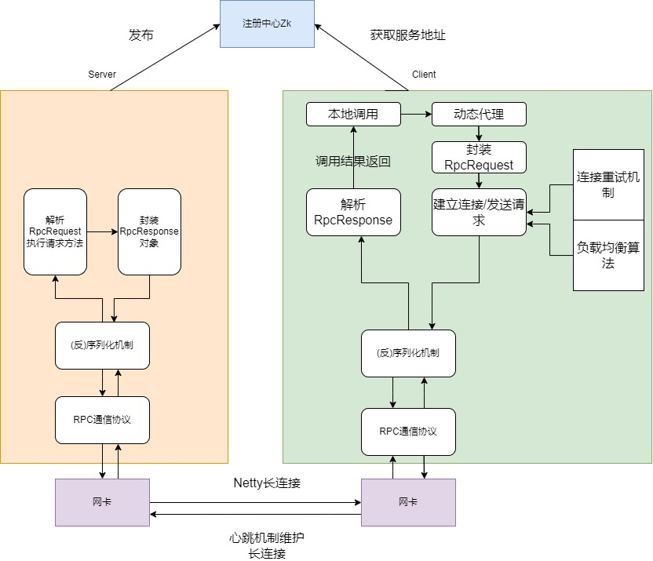

# MyRpc
a rpc framework based on java

## 架构



## 特性

1. 使用Netty作为底层网络通信框架，NIO提升网络通信效率
2. 采用Netty长连接机制，避免不必要的重复连接开销
3. 使用心跳包维护上述长连接
4. 客户端采用`Failover`重连机制，应对连接远程服务端失败的情况
5. 客户端实现负载均衡算法选择连接的服务端(实现随机负载均衡和一致性哈希负载均衡算法)
6. 两种序列化和反序列化方式(java原生+protobuf)
7. 自定义注解，方便服务提供者和消费者注册和消费服务
8. 集成Spring框架，通过注解注册服务，通过注解消费服务
9. 实现SPI机制，实现 接口实现类的动态插拔
10. 采用了单例设计模式
11. 异步IO场景下，使用`CompletableFuture`阻塞地同步获取响应结果。优化了原本的自旋获取响应结果，减少CPU负载。

## 项目模块

- rpc-framework-core:rpc核心功能部分代码实现

- rpc-example-client:测试用客户端
- rpc-example-server:测试用服务端

## 传输协议

使用自定义RPC协议规定数据格式，解决TCP粘包、拆包问题。 

```
+---------------+---------------+-----------------+-------------+
|  Magic Number |  Package Type | Serializer Type | Data Length |
|    4 bytes    |    4 bytes    |     4 bytes     |   4 bytes   |
+---------------+---------------+-----------------+-------------+
|                          Data Bytes                           |
|                   Length: ${Data Length}                      |
+---------------------------------------------------------------+
```
```

字段					解释
Magic Number		 魔数，表识一个 RPC 协议包，暂时待定
Package Type		 包类型，标明这是一个调用请求还是调用响应
Serializer Type		 序列化器类型，标明这个包的数据的序列化方式
Data Length			 数据字节的长度
Data Bytes			 传输的对象，通常是一个RpcRequest或RpcResponse对象，取决于Package Type字段，对象的序列化方式取决于Serializer Type字段。
```